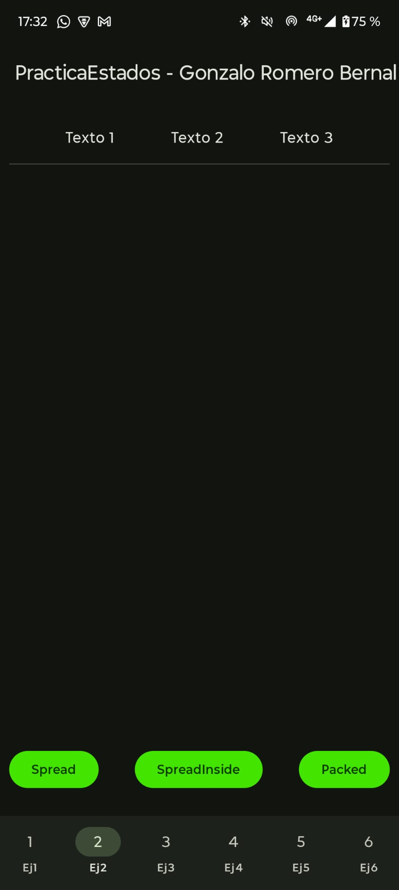

# Práctica Estados - Gonzalo Romero Bernal

---

# 📑 Índice

1. [Creación del proyecto](#creación-del-proyecto)
2. [Ejercicio 1 — Ficha de producto](#ejercicio-1--ficha-de-producto)
3. [Ejercicio 2 — Acciones principales en una barra](#ejercicio-2--acciones-principales-en-una-barra)
4. [Ejercicio 3 — Cambiando colores con estado](#ejercicio-3--cambiando-colores-con-estado)
5. [Ejercicio 4 — Contador doble](#ejercicio-4--contador-doble)
6. [Ejercicio 5 — Interruptor de visibilidad](#ejercicio-5--interruptor-de-visibilidad)
7. [Ejercicio 6 — Tarjeta de evento interactiva](#ejercicio-6--tarjeta-de-evento-interactiva)

---

## Creación del proyecto
**Nombre del proyecto:** practicaLayout2
**Tipo:** Empty Activity  
**Lenguaje:** Kotlin  
**Min SDK:** API 21 (Android 5.0)

---

## Ejercicio 1 — Ficha de producto
**Explicación:** He realizado una tarjeta de presentación de un producto, en la que he integrado una imagen recortada con textos superpuestos, en los que he empleado una disposición por capas mediante el uso de Box.

**Foto:**

**Código:**
https://github.com/gromber05/practicaLayout2/blob/0027e279e7cace8fc7c202719c8e84ce04b80fb2/app/src/main/java/com/gromber05/practicalayout2/Ejercicios/Ejercicio01FichaProducto.kt#L23-L94

---

## Ejercicio 2 — Acciones principales en una barra

**Explicación:**  Para este ejercicio, lo que he realizado ha sido una barra de acciones que contiene tres botones que se han distribuido mediante ConstraintLayout y una cadena horizontal. Se ha pedido que se apliquen diferentes estilos de cadena entre los que se encuentran: Spread, SpredInside y Packed. Cada botón provoca que aparezca un Toast de distintas duraciones

**Foto**:

**Código:**
https://github.com/gromber05/practicaLayout2/blob/0027e279e7cace8fc7c202719c8e84ce04b80fb2/app/src/main/java/com/gromber05/practicalayout2/Ejercicios/Ejercicio02AccionesPrincipales.kt#L19-L54

---

## Ejercicio 3 — Cambiando colores con estado

**Explicación:** En este ejercicio se ha implementado un ejemplo de gestión de estado en Compose, donde mostramos un cubo en pantalla que cambia de color aleatoriamente al pulsar un botón. Se usa rememberSaveable junto con ColorSaver para poder almacenar el valor de color actual en conjunto con su nombre incluso tras recomponer el contenido. 

**Foto:**

**Código:**
https://github.com/gromber05/practicaLayout2/blob/0027e279e7cace8fc7c202719c8e84ce04b80fb2/app/src/main/java/com/gromber05/practicalayout2/Ejercicios/Ejercicio03ColoresEstado.kt#L25-L62

---

## Ejercicio 4 — Contador doble

**Explicación:** En este ejercicio, hemos comprobado como funciona el estado y la persistencia de rememberSaveable en JetpackCompose. Esta pantalla muestra dos botones, uno para sumar y otro para restar a una variable que funciona de contador. También hemos puesto una regla al contador que hace que no recoja numeros negativos.

**Foto:**

**Código:**
https://github.com/gromber05/practicaLayout2/blob/0027e279e7cace8fc7c202719c8e84ce04b80fb2/app/src/main/java/com/gromber05/practicalayout2/Ejercicios/Ejercicio04ContadorDoble.kt#L20-L39

---

## Ejercicio 5 — Interruptor de visibilidad

**Explicación:** En este ejercicio, he desarollado un componente interactivo que permite ocultar o mostrar un texto presionando un botón. He creado una variable de estado con rememberSaveable para garantizar que el valor del estado no se pierda despues de una recomposición.

**Foto:**

**Código:**
https://github.com/gromber05/practicaLayout2/blob/0027e279e7cace8fc7c202719c8e84ce04b80fb2/app/src/main/java/com/gromber05/practicalayout2/Ejercicios/Ejercicio05Visibilidad.kt#L19-L36

---

## Ejercicio 6 — Tarjeta de evento interactiva

**Explicación:** En este ejercicio se ha pedido una tarjeta interactiva en la que los componentes esten divididos en diferentes archivos. En el primero es simplemente un punto de acceso al ejercicio. En el archivo EventActions se define la fila de acciones que podemos ejecutar dentro de la tarjeta interactiva, como lo son Interesa, Compartir y Guardar.
Estoy usando ConstraintLayout con una cadena horizontal SpreadInside, de esta manera, puedo distribuir los tres textos con espacio suficiente en los extremos.
EventCard es el componente principal y el interactivo. En este se muestra una imagen mediante el método AsyncImage de Coil y posee titulos y subtitulos superpuestos con fondos semitransparentes para que sea legible. Debajo, la descripción se puede expandir o contraer con el texto "Mostrar más/menos" y luego se inserta la fila con las interacciones del archivo EventActions. Todo el diseño se organiza con ConstraintLayout usando barreras y restricciones.

**Foto:**

**Código:**
https://github.com/gromber05/practicaLayout2/blob/0027e279e7cace8fc7c202719c8e84ce04b80fb2/app/src/main/java/com/gromber05/practicalayout2/Ejercicios/EjercicioExtra/Main.kt#L12-L25

https://github.com/gromber05/practicaLayout2/blob/0027e279e7cace8fc7c202719c8e84ce04b80fb2/app/src/main/java/com/gromber05/practicalayout2/Ejercicios/EjercicioExtra/components/EventCard.kt#L26-L208

https://github.com/gromber05/practicaLayout2/blob/3782c11c895cc36ae18feb5deff0180c5d90f4a0/app/src/main/java/com/gromber05/practicalayout2/Ejercicios/EjercicioExtra/components/EventActions.kt#L15-L71